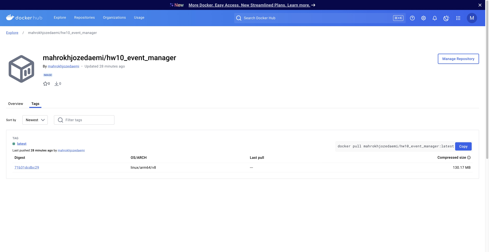

# Event Manager Company: Software QA Analyst/Developer Onboarding Assignment

Welcome to the Event Manager Company! As a newly hired Software QA Analyst/Developer and a student in software engineering, you are embarking on an exciting journey to contribute to our project aimed at developing a secure, robust REST API that supports JWT token-based OAuth2 authentication. This API serves as the backbone of our user management system and will eventually expand to include features for event management and registration.

# Links to Closed Issues

## Closed Issues

Below are the links to the closed issues that provide insights into the work done for this project:

1. [Investigate and Fix Pytest Errors](https://github.com/MahrokhJozedaemi2016/HW10_event_manager/issues/1)
2. [OpenAPI Docs Page Login and Register Example Mismatch](https://github.com/MahrokhJozedaemi2016/HW10_event_manager/issues/3)
3. [Update Conftest, Rename .env.sample, and Update Requirements](https://github.com/MahrokhJozedaemi2016/HW10_event_manager/issues/5)
4. [Refactor Password Validation and Error Messages](https://github.com/MahrokhJozedaemi2016/HW10_event_manager/issues/7)
5. [Add Health Check Endpoint for Docker Environment](https://github.com/MahrokhJozedaemi2016/HW10_event_manager/issues/8)
6. [Reflect and Finalize ReadMe File](https://github.com/MahrokhJozedaemi2016/HW10_event_manager/issues/11)

# Link to the Docker Image

## Docker Image

The project has been deployed as a Docker image for easy containerized setup. You can find the image on DockerHub:

[HW10 Event Manager Docker Image](https://hub.docker.com/r/mahrokhjozedaemi/hw10_event_manager/tags)

# Link to the Docker Image

# Reflection Section

## Reflection

This project was a great learning opportunity that allowed me to enhance my technical and collaborative skills. I worked extensively with Docker, FastAPI, and GitHub workflows to ensure a robust and functional API. I learned how to efficiently debug test failures using `pytest` and improved code quality by implementing robust validation mechanisms, such as password validation and error handling.

One of the most challenging aspects was resolving merge conflicts when working collaboratively on GitHub. Understanding the structure of conflicting files and carefully merging changes taught me the importance of clear commit messages and structured coding practices. Additionally, creating meaningful tests for edge cases and ensuring proper OpenAPI documentation improved my attention to detail and API usability.

Through this assignment, I gained insights into project management and development lifecycle processes, including how to integrate containerized environments, test reliability, and API consistency. The experience of deploying the project to DockerHub solidified my understanding of DevOps workflows, providing a complete end-to-end perspective on application development.
