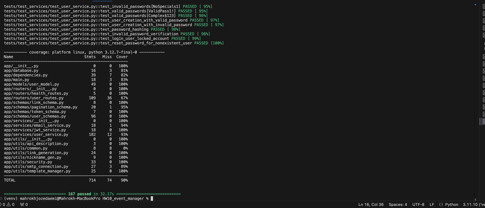
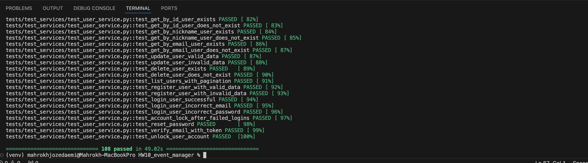
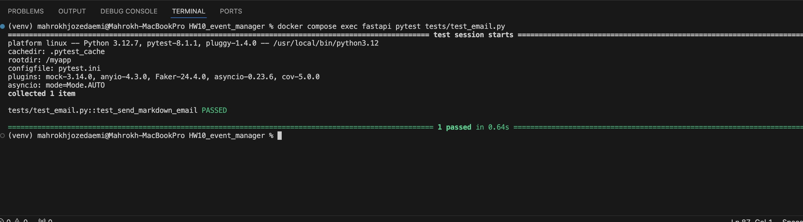
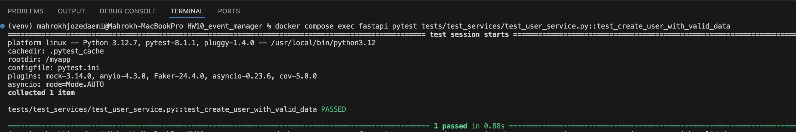
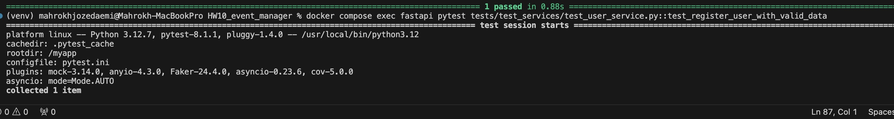
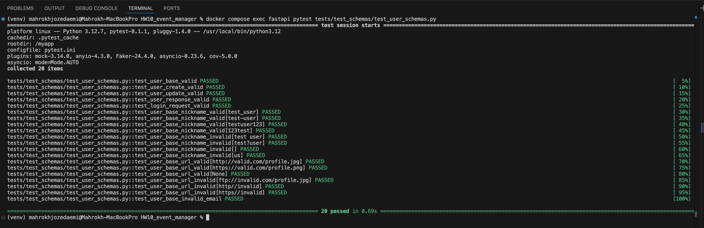
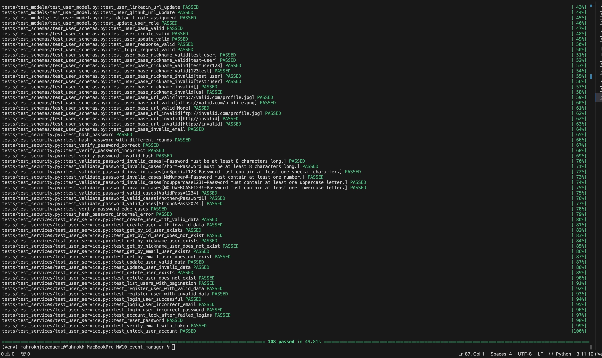
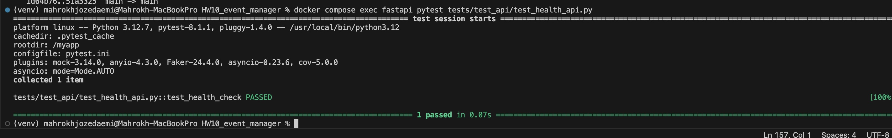
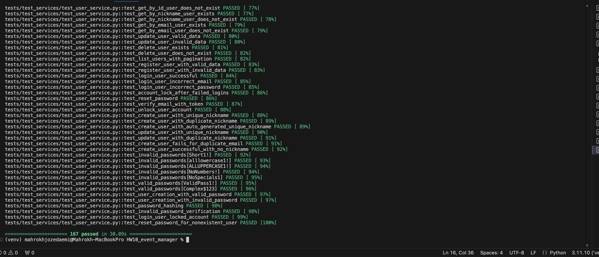

# HW10

# Event Manager Company: Software QA Analyst/Developer Onboarding Assignment

Welcome to the Event Manager Company! As a newly hired Software QA Analyst/Developer and a student in software engineering, you are embarking on an exciting journey to contribute to our project aimed at developing a secure, robust REST API that supports JWT token-based OAuth2 authentication. This API serves as the backbone of our user management system and will eventually expand to include features for event management and registration.

# Links to Closed Issues
  
## Closed Issues
Below are the links to the closed issues that provide insights into the work done for this project:

1. [Investigate and Fix Pytest Errors](https://github.com/MahrokhJozedaemi2016/HW10_event_manager/issues/1)
2. [Set Up Mailtrap Email Service and Update .env File](https://github.com/MahrokhJozedaemi2016/HW10_event_manager/issues/3)
3. [Implement Enhanced Username Validation](https://github.com/MahrokhJozedaemi2016/HW10_event_manager/issues/5)
4. [Implement Enhanced Username Validation](https://github.com/MahrokhJozedaemi2016/HW10_event_manager/issues/7)
5. [Test Update User Invalid Data to Match Current UserService.update](https://github.com/MahrokhJozedaemi2016/HW10_event_manager/issues/8)
6. [Add a Health Check Endpoint to the API](https://github.com/MahrokhJozedaemi2016/HW10_event_manager/issues/11)
7. [Username Uniqueness](https://github.com/MahrokhJozedaemi2016/HW10_event_manager/issues/13)
8. [Improve Profile Update Endpoints and Enhance Login Functionality with Authorization](https://github.com/MahrokhJozedaemi2016/HW10_event_manager/issues/15)

# Link to the Docker Image

## Docker Image

The project has been deployed as a Docker image for easy containerized setup. You can find the image on DockerHub:

[HW10 Event Manager Docker Image](https://hub.docker.com/r/mahrokhjozedaemi/hw10_event_manager/tags)

# Link to the Docker Image

# Reflection Section

## Reflection

This project was a great learning opportunity that allowed me to enhance my technical and collaborative skills. I worked extensively with Docker, FastAPI, and GitHub workflows to ensure a robust and functional API. I learned how to efficiently debug test failures using `pytest` and improved code quality by implementing robust validation mechanisms, such as password validation and error handling.

One of the most challenging aspects was resolving merge conflicts when working collaboratively on GitHub. Understanding the structure of conflicting files and carefully merging changes taught me the importance of clear commit messages and structured coding practices. Additionally, creating meaningful tests for edge cases and ensuring proper OpenAPI documentation improved my attention to detail and API usability.

Through this assignment, I gained insights into project management and development lifecycle processes, including how to integrate containerized environments, test reliability, and API consistency. The experience of deploying the project to DockerHub solidified my understanding of DevOps workflows, providing a complete end-to-end perspective on application development.

# Test Coverage:

# Issues details:

# Investigate and Resolve Pytest Failures
## Description:       
The project's test suite is currently failing during pytest runs, which may indicate underlying issues that need to be addressed. Potential causes could include:

- Outdated or improperly configured test fixtures.    
- Missing or incorrect environment variable settings required for tests to execute properly.       
- Application logic errors or unexpected behaviors impacting the test results.       

## Expected Outcome:       

- Ensure all tests in the suite pass successfully without errors.       
- Identify and resolve any broken test fixtures or misconfigurations.         
- Verify the environment setup and correct any missing or invalid variables.         
- Address any application issues that might be causing the test failures to achieve a stable and reliable test suite.        

## Pytest Results

# Configure Mailtrap Email Service and Resolve SMTP Testing Issues
## Description
The project relies on an SMTP server for email functionality, but misconfigurations have resulted in failed email-related tests. Current tests are attempting to connect to an SMTP server, but the server is either inaccessible or improperly configured for testing purposes, leading to disconnection errors.     
## Key Issues Identified:      
- Email tests, such as test_send_markdown_email and user-related tests, fail due to SMTPServerDisconnected errors.        
- The lack of a properly configured testing SMTP service hinders reliable email functionality testing during development.         
## Expected Outcome:         

- Integrate and configure Mailtrap as the testing SMTP server for the project.             
- Ensure the .env file is updated with the correct Mailtrap credentials to facilitate testing in a controlled environment.              
- Run previously failing tests (e.g., email and user service tests) and confirm they pass successfully without SMTP-related errors.             
- Provide a reliable email testing setup to enhance development efficiency and debugging.                

## Email Service Tests

### Test Email

### Test Create User

### Test Register User

# Implement Enhanced Username Validation     
## Description:     
The current validation logic for nicknames permits underscores and hyphens but lacks sufficient restrictions. To improve consistency and prevent misuse, the following additional rules need to be implemented:      

- Nicknames must not begin with a numerical character.        
- The maximum allowable length is restricted to 30 characters.           
- Only alphanumeric characters, underscores (_), and hyphens (-) are permitted.            
## Expected Outcome:           
- Acceptable Nicknames: Examples such as john_doe, Test-User, and username123 should pass validation checks during user creation or updates.         
- Unacceptable Nicknames: Invalid inputs like 123username, invalid!, or toolong_nickname_that_exceeds_30_chars should be rejected.            
- Error Handling: Users who attempt to use nicknames with invalid formats should receive descriptive error messages explaining the issue.           

### Test Schemas

# Enhance Password Validation for Improved Security        

## Description:        
To align with security best practices and protect user accounts, robust password validation rules are necessary. The following measures should be implemented:         
- Enforce a minimum length requirement for passwords.         
- Ensure password complexity by requiring a combination of uppercase letters, lowercase letters, numbers, and special characters.           
- Hash passwords securely before storing them in the database to prevent exposure in case of a breach.             
- These enhancements will significantly reduce the risk of unauthorized access and strengthen the application’s overall security.            

## Expected Outcome:        
- Implemented password rules should ensure that only secure and valid passwords are accepted.            
- Passwords that do not meet complexity or length requirements will be rejected with clear error messages.           
- All tests verifying the enhanced password validation logic should pass successfully.         

### Password Validation

# Align test_update_user_invalid_data with Current UserService.update Behavior             
 
## Description:         
The test_update_user_invalid_data test was failing because it assumed that the UserService.update method would return None when invalid data was provided. However, the current implementation of UserService.update raises a ValueError for invalid input. This mismatch caused the test to fail, requiring adjustments to ensure it aligns with the updated behavior.             

## Expected Outcome:          
- The test is updated to handle the ValueError raised by UserService.update.              
- The test uses pytest.raises to verify that a ValueError is raised for invalid input.               
- The test checks that the error message matches the one defined in the UserService.update method.               
- After the updates, the full test suite runs successfully, confirming alignment with the current method behavior.              

### Pytest Results

# Add Health Check Endpoint to Enhance API Monitoring            

## Description:           
The API currently does not include a dedicated health check endpoint, which is essential for determining whether the service is operational. Implementing a /health endpoint will allow for quick and efficient monitoring of the API's status. This endpoint is particularly valuable for integration with deployment pipelines, load balancers, and automated monitoring systems.           

## Expected Outcome:          
- Introduce a /health endpoint that responds without requiring authentication.                   
- The endpoint should return a 200 OK status along with a JSON response, such as {"status": "healthy"}.                        
- Enhance API usability by providing an easy and programmatic way to verify service availability and health.                   

### Health Check Endpoint Test

# Ensure Unique Nicknames to Prevent Duplication          

## Description:               
During the improvement of nickname validation, it was discovered that the system does not currently enforce uniqueness for usernames. This allows duplicate nicknames to be stored in the database, potentially causing issues such as user confusion, compromised data consistency, and security vulnerabilities.               

## Expected Outcome:            
The system must enforce uniqueness for nicknames at both the application and database layers.
Any attempt to create or modify a user with a duplicate nickname should result in an error, providing a clear and actionable message to the user.

### Username Uniqueness Test       

# Enhance Profile Update Functionality and Refactor Login Authentication        

## Description:        
This update resolves two significant issues in the application:
- The absence of dedicated endpoints for updating specific user profile fields, which limited flexibility and efficiency.            
- Redundant logic in the /login endpoint, which affected code maintainability and the functionality of Swagger-based admin authentication.           

## Expected Outcomes:             
- Introduce profile update endpoints that support targeted updates with strong input validation and enforce role-based access control for authorized users.             
- Refactor the /login endpoint to remove redundancy, improving maintainability while ensuring secure and consistent authentication.                
- Enable admin users to authenticate seamlessly using Swagger's Authorize button for improved usability.               
- Ensure that all tests for validation, endpoints, and login functionality pass successfully, enhancing the application’s reliability and security.            

### Profile Update and Login Functionality Test

